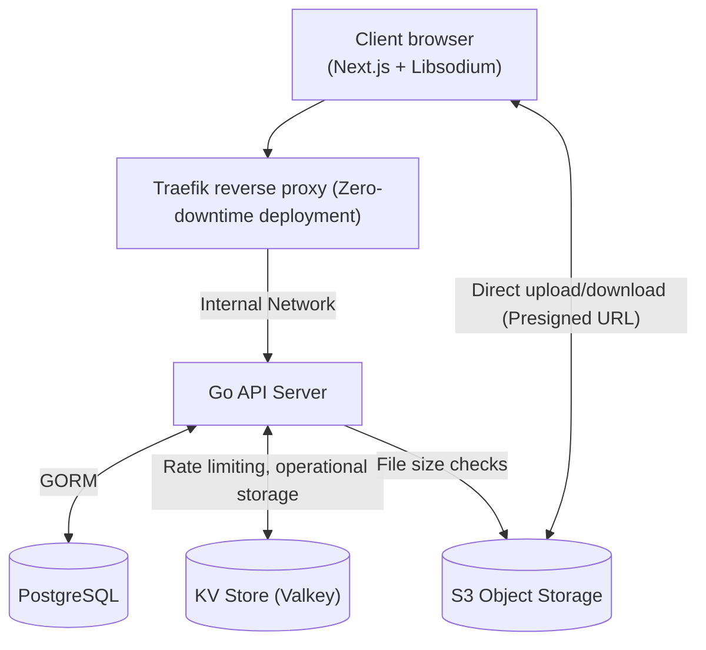

# Quartz Drive

**Zero-Knowledge, End-to-End Encrypted (E2EE) Cloud Storage Platform**

[](LICENSE)

---

**Quartz Drive** is a cloud storage application engineered with a strict **Zero-Knowledge Architecture**. The server never receives, processes, or stores raw user passwords, plaintext encryption keys, or unencrypted file contents.

> Check out the live demo [here](https://quartzapp.top).

> [!CAUTION]
> Quartz Drive is currently in the **alpha** stage and is not production-ready. Do not upload data as the application is unstable and data loss can occur without notice.
> 
> Cryptography was tested, however beware that the code has not  been audited by the community or security experts.
> We are not liable for any data loss or data leakage during the alpha stage. You are using Quartz Drive at your own risk.

---

### Live Demo

> [!WARNING]
> * **Don't upload sensitive files**, or files that aren't backed up somewhere else.
> * **Data loss can occur at any time**, since this is a demo and the project is under heavy development.
> * Demo sessions are set to **expire after 1 hour** or on user-initiated sign out.
> * Sessions can expire at any time without notice.
> * Storage quota is limited to 100MB and APIs are heavily rate limited.
> * Every demo session contains files already uploaded earlier for test purposes. You can delete them, or upload new files.
>
> Terms are subject to change.

The demo is available [here](https://quartzapp.top).

### Architecture & Security Highlights

* **Zero-Knowledge Authentication (OPAQUE PAKE Protocol)**: Replaces traditional password transmissions with the OPAQUE Password-Authenticated Key Exchange protocol (`@serenity-kit/opaque` / `@facebook/opaque-ke` ). The server never sees / touches raw passwords or password hashes. This is the foundation of our E2EE architecture.
* **Hierarchical Key Architecture**: Master Key → OPAQUE export key → Account Encryption Key → Node Keys → File Block Keys → Decrypted File). Folder and file keys use **X-Wing** asymmetric envelope wrapping, enabling secure post-quantum-proof folder operations without re-encrypting child nodes.
* **Hardware-Bound Sessions (DPoP)**: Demonstrating Proof-of-Possession access tokens are cryptographically bound to the client's physical browser key pair - preventing session token replay attacks even if tokens are stolen.
* **Persistent Sessions in Browser**: Keys are encrypted using device private key stored in IndexedDB - this key never leaves the device. Wrapped account keys are stored on the database tied to that specific device. We store them server-side to easily restore user sessions without re-typing the password. We cannot access these wrapped keys, because we simply don't have the device private key.
* **Timing Attack Mitigation**: Constant-time execution paths on user lookup and authentication endpoints to prevent email enumeration.

Quartz Drive protects user data even under complete server compromise or database leaks, for example: users' email addresses are never stored in plaintext, they're encrypted and hashed, which protects PII even in case of a database breach.


---

## Technology Used

| Layer                | Technologies & Libraries                                       |
|:---------------------|:---------------------------------------------------------------|
| **Backend**          | Go 1.26+, GORM, JSON Web Tokens, Asynq (Background worker)     |
| **Frontend**         | Next.js 16, Zustand, Tailwind CSS                              |
| **Cryptography**     | Libsodium (`libsodium-wrappers-sumo`), OPAQUE PAKE, Web Crypto |
| **Database & Cache** | PostgreSQL 18, Valkey (Redis fork)                             |
| **Storage & Edge**   | S3-compatible storage, Traefik Reverse Proxy, Docker           |

---

## System Topology Overview



> For more details on architecture, cryptography, and key management specifications, see [ARCHITECTURE.md](ARCHITECTURE.md) (Work in Progress).

---
## Local Development

### Prerequisites
* **Go** 1.26+
* **Node.js** 20+ & **npm**
* **Docker** & **Docker Compose**

### 1. Clone the project
```bash
git clone https://github.com/Jacobinoo/quartz-drive.git
cd quartz-drive/server
```

### 2. Setup local environment
Example environment is ready for development, but we encourage you to look at the variables and make necessary changes. We recommend generating your own secret keys.
```bash
# Copy example environment
cp example.env .env.development
```

### 3. Setup required services
This command will set up the local infrastructure (API server, PostgreSQL database, Valkey and finally SeaweedFS S3 object storage):
```bash
docker-compose -f docker-compose.dev.yml up -d
```

### 4. Run the frontend
This command will run the Next.js development server:
```bash
cd ../web
npm install
npm run dev
```

The application will be accessible at `http://localhost:3000`.

---
## License
Distributed under the **GNU Affero General Public License v3.0 (AGPL-3.0)**. See [`LICENSE`](LICENSE) for more details.

---

Designed and developed with ❤️ in Poland.

